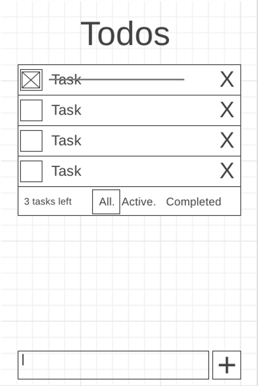

# TODO List Challenge App

Over the next 2 weeks we will practice what we have learned so far by building a small web application. For this first challenge we will all build a simple To Do tracking application.

Review the details in the simple design document below, then build the application. This will be due at the end of Week 6. You will turn it in as part of your portfolio on the Midterm Checkin.
1. Description: Build a simple web app to manage a ToDo list. It should allow the creation of new tasks, the viewing of tasks, a process to mark tasks as complete, ability to remove tasks, and the ability to filter by complete/not complete.

2. Wireframes for each view:

|  |
|:--:|
| *Wireframe* |

3. UI actions
	- Show a list of tasks.
	- Add a new task.
	- Complete a task.
	- Remove a task.
	- Filter tasks (complete/incomplete).

4. Data sources: localStorage
	-	todo: { id : timestamp, content: string, completed: bool }
	-	toDoList = [toDo];

5. Initial Module list:
   1. ToDos.js,
   2. localStorage helpers (ls.js),
   3. utilities.js

6. Colors/Typography/specific Element styling: Student to determine

7. Schedule to provide yourself mile markers along the way to help you stay on target.
	- Review this https://trello.com/b/94QLblUO/todo-project . If you want to follow those steps, create a Trello account and copy the board to your account.
	- There are no dates assigned to the board. Assign yourself some due dates to make sure you complete the project in the allotted time.